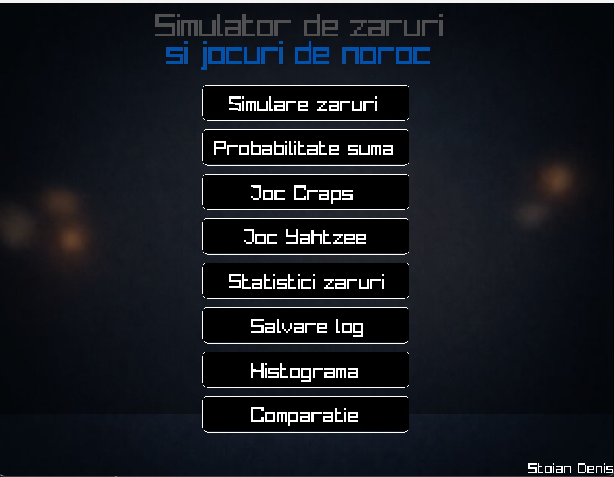
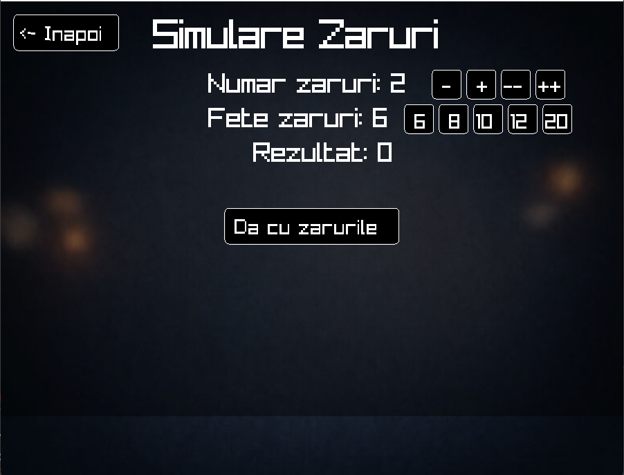
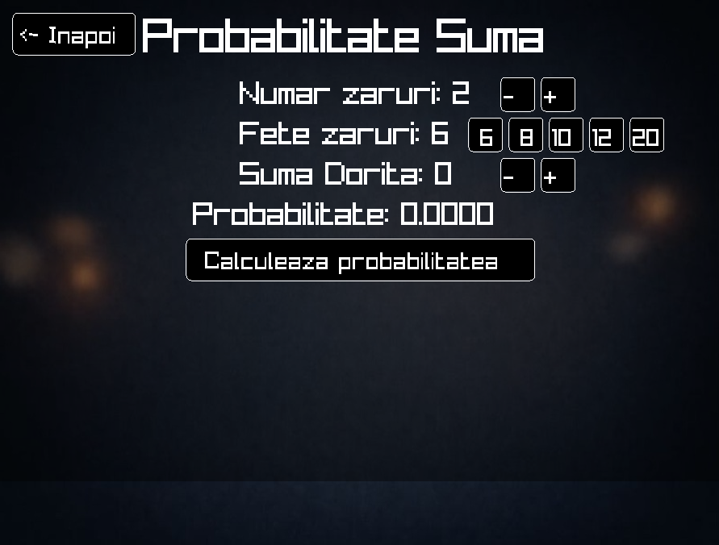
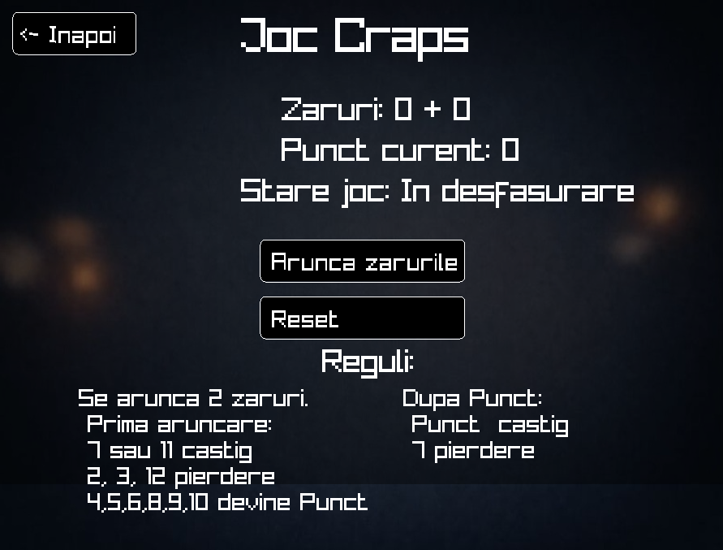
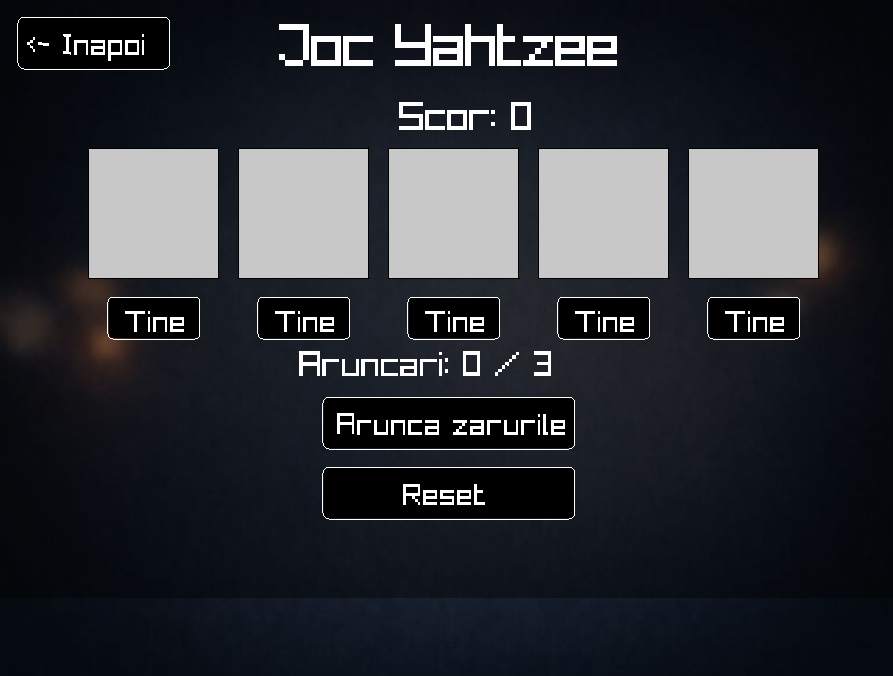
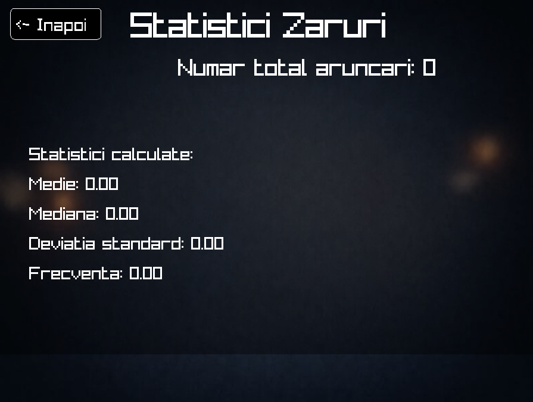
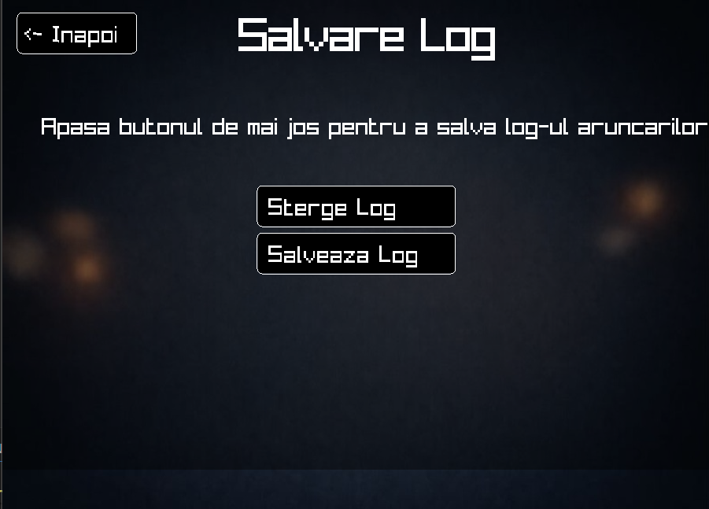
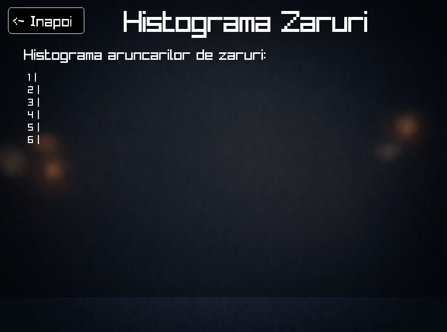
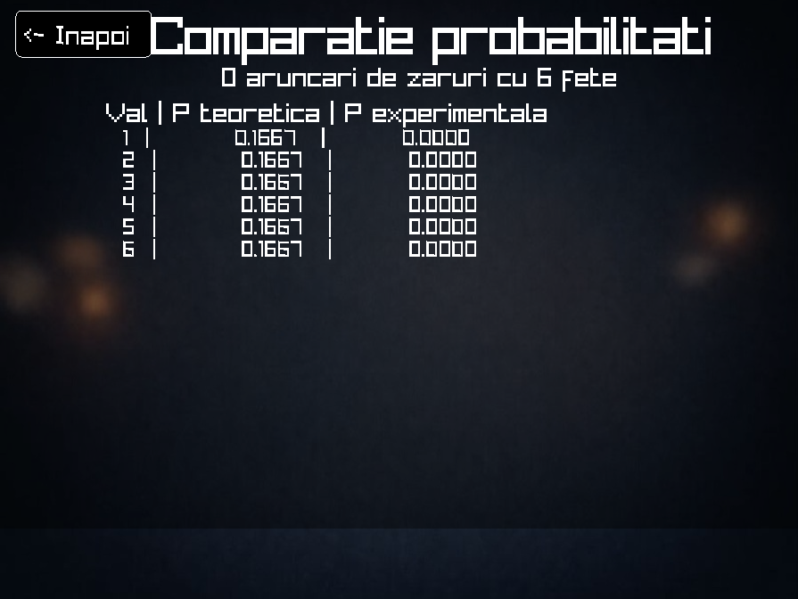

# Simulator de Zaruri și Jocuri de Noroc

**Autor:** Stoian Denis  
**Limbaj:** C  
**Bibliotecă grafică:** raylib  

---

## Descriere generală

Acest program este o aplicație grafică realizată în limbajul **C**, folosind biblioteca **raylib**, care simulează aruncarea zarurilor și implementează mai multe jocuri de noroc și analize statistice.

Aplicația permite utilizatorului să interacționeze printr-un **meniu grafic**, folosind mouse-ul și butoane, fără a fi nevoie de introducere de date de la tastatură.

Scopul principal al programului este:
- simularea fenomenelor aleatoare (zaruri),
- calcularea probabilităților teoretice,
- analiza statistică a rezultatelor,
- compararea probabilităților teoretice cu cele experimentale,
- implementarea unor jocuri reale de noroc.

---

## Structura aplicației

Programul este organizat sub forma unor **ecrane (screens)**, controlate de un meniu principal.  
Navigarea între ecrane se face prin butoane grafice.

### Meniul principal conține următoarele opțiuni:
1. Simulare zaruri  
2. Probabilitate sumă  
3. Joc Craps  
4. Joc Yahtzee  
5. Statistici zaruri  
6. Salvare log  
7. Histogramă  
8. Comparație probabilități  



---

## Funcționalități

### 1️ Simulare Zaruri
- Utilizatorul poate alege:
  - numărul de zaruri
  - numărul de fețe ale zarurilor (6, 8, 10, 12, 20)
- La apăsarea butonului **„Da cu zarurile”**:
  - se generează valori aleatoare
  - se calculează suma zarurilor
  - rezultatele sunt salvate pentru analize ulterioare

  

---

### 2️ Probabilitate Suma
- Calculează **probabilitatea teoretică** de a obține o anumită sumă
- Se ține cont de:
  - numărul de zaruri
  - numărul de fețe
  - suma dorită
- Probabilitatea este calculată matematic, folosind combinații posibile



---

### 3️ Joc Craps
- Implementare a jocului de noroc **Craps**
- Reguli:
  - Prima aruncare:
    - 7 sau 11 → câștig
    - 2, 3 sau 12 → pierdere
    - alte valori → devin „punct”
  - După stabilirea punctului:
    - punct → câștig
    - 7 → pierdere
- Jocul afișează starea curentă a jocului



---

### 4️ Joc Yahtzee
- Joc cu 5 zaruri
- Maxim 3 aruncări
- Utilizatorul poate:
  - păstra anumite zaruri
  - re-arunca doar zarurile neținute
- Scor:
  - suma zarurilor
  - **Yahtzee (toate zarurile egale) → 50 puncte**



---

### 5️ Statistici Zaruri
Pe baza tuturor aruncărilor realizate în aplicație se calculează:
- **Media**
- **Mediana**
- **Deviația standard**
- **Frecvența apariției valorilor**

Aceste statistici ajută la analiza distribuției rezultatelor.



---

### 6️ Salvare Log
- Toate aruncările sunt salvate într-un fișier text `log_zaruri.txt`
- Fiecare linie conține:
  - numărul aruncării
  - valoarea obținută
- Există opțiunea de ștergere a fișierului log



---

### 7️ Histogramă
- Reprezentare grafică a frecvenței apariției valorilor
- Fiecare valoare este afișată sub formă de bară
- Permite observarea vizuală a distribuției rezultatelor



---

### 8️ Comparație Probabilități
- Compară:
  - probabilitatea **teoretică** (1 / număr de fețe)
  - probabilitatea **experimentală** (obținută din simulări)
- Demonstrează apropierea rezultatelor experimentale de cele teoretice



---

##  Aspecte tehnice

- Generarea numerelor aleatoare se face cu `rand()`
- Rezultatele sunt stocate în vectori
- Interfața grafică este realizată manual
- Programul rulează la 60 FPS
- Structurarea aplicației este făcută pe funcții separate

---

###  Construirea imaginii Docker

Din directorul principal al proiectului, se rulează comanda:

```bash
##  Construirea imaginii

docker build -t dice_game .

## Pornirea imaginii Docker

docker run -p 8000:80 dice_game 

##  Deschiderea imaginii pe web

http://localhost:8000/dice_game.html
